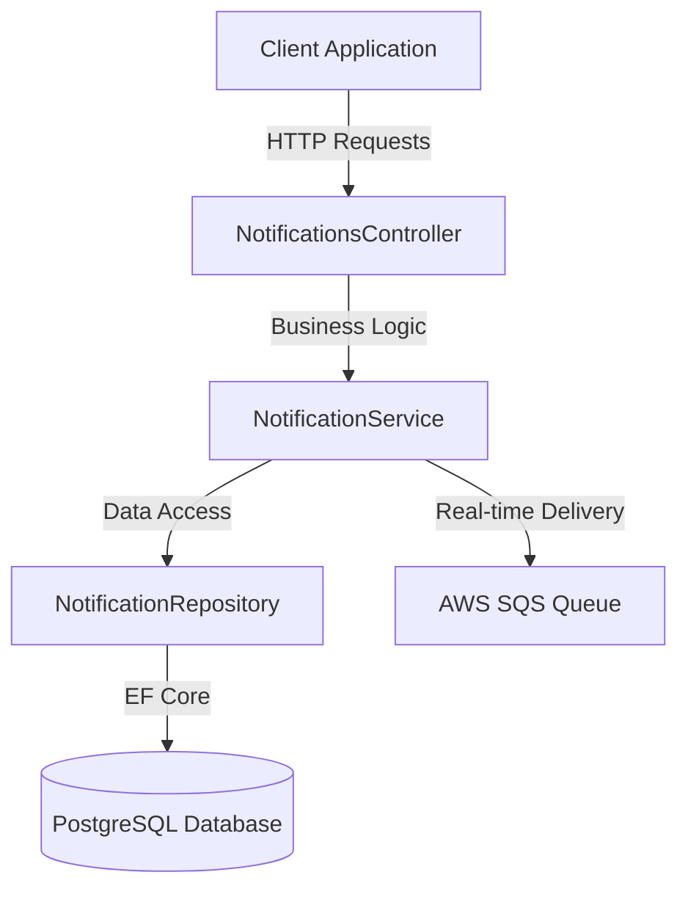

# Design Document: Persistent Notification Storage

## Overview

This design adds persistent storage capabilities to the NotificationAPI system by integrating PostgreSQL database support using Entity Framework Core. Currently, notifications are ephemeral - they exist only in AWS SQS and are deleted immediately upon retrieval. This enhancement transforms the notification system into a full-featured notification management platform with persistent history, read/unread tracking, and advanced querying capabilities.

The design maintains backward compatibility with the existing SQS-based notification delivery while adding a database layer that serves as the source of truth for notification data. The system will continue to send notifications to SQS for real-time delivery, but will also persist them to PostgreSQL for long-term storage and management.

### Key Design Goals

1. **Persistence**: Store all notifications permanently in PostgreSQL
2. **Read Status Tracking**: Support marking notifications as read/unread with timestamps
3. **Query Capabilities**: Enable filtering, pagination, and sorting of notification history
4. **Backward Compatibility**: Maintain existing SQS integration for real-time delivery
5. **Testability**: Implement repository pattern for easy unit testing
6. **Performance**: Use database indexes for efficient querying

## Architecture

### System Components



### Data Flow

**Sending Notifications:**
1. Client sends POST request to `/api/notifications`
2. Controller validates request and calls NotificationService
3. NotificationService creates Notification entity
4. Service persists notification to database via Repository (primary operation)
5. Service sends notification to SQS queue (secondary operation, best-effort)
6. Controller returns success response

**Retrieving Notifications:**
1. Client sends GET request to `/api/notifications` with optional filters
2. Controller calls NotificationService with query parameters
3. Service queries database via Repository with filters and pagination
4. Repository returns paginated results ordered by CreatedAt descending
5. Controller returns JSON response with notifications and pagination metadata


**Marking Notifications as Read/Unread:**
1. Client sends PUT request to `/api/notifications/{id}/read` or `/api/notifications/{id}/unread`
2. Controller calls NotificationService with notification ID
3. Service updates notification via Repository
4. Repository updates IsRead and ReadAt fields
5. Controller returns updated notification

### Technology Stack

- **Database**: PostgreSQL (shared with ContosoUniversity)
- **ORM**: Entity Framework Core 8.0 with Npgsql provider
- **Migration Tool**: EF Core Migrations
- **Dependency Injection**: ASP.NET Core built-in DI container
- **Logging**: Microsoft.Extensions.Logging

## Components and Interfaces

### 1. Notification Entity (Enhanced)

The existing `Notification` model already contains all required properties. No changes needed to the entity definition.

**File**: `NotificationAPI/Models/Notification.cs`

```csharp
public class Notification
{
    [Key]
    public int Id { get; set; }
    
    [Required]
    [StringLength(100)]
    public required string EntityType { get; set; }
    
    [Required]
    [StringLength(50)]
    public required string EntityId { get; set; }
    
    [Required]
    [StringLength(20)]
    public required string Operation { get; set; }
    
    [Required]
    [StringLength(256)]
    public required string Message { get; set; }
    
    [Required]
    public DateTime CreatedAt { get; set; }
    
    [StringLength(100)]
    public required string CreatedBy { get; set; }
    
    public bool IsRead { get; set; }
    
    public DateTime? ReadAt { get; set; }
}
```

### 2. NotificationContext (DbContext)

**File**: `NotificationAPI/Data/NotificationContext.cs`

```csharp
public class NotificationContext : DbContext
{
    public NotificationContext(DbContextOptions<NotificationContext> options) 
        : base(options) { }
    
    public DbSet<Notification> Notifications { get; set; }
    
    protected override void OnModelCreating(ModelBuilder modelBuilder)
    {
        modelBuilder.Entity<Notification>(entity =>
        {
            entity.ToTable("Notification");
            entity.HasKey(e => e.Id);
            entity.Property(e => e.Id).ValueGeneratedOnAdd();
            
            // Create indexes for efficient querying
            entity.HasIndex(e => e.CreatedAt).HasDatabaseName("IX_Notification_CreatedAt");
            entity.HasIndex(e => e.IsRead).HasDatabaseName("IX_Notification_IsRead");
        });
    }
}
```


### 3. Repository Pattern

**Interface**: `NotificationAPI/Repositories/INotificationRepository.cs`

```csharp
public interface INotificationRepository
{
    Task<Notification> CreateAsync(Notification notification);
    Task<Notification?> GetByIdAsync(int id);
    Task<(List<Notification> notifications, int totalCount)> GetAllAsync(
        bool? isRead = null, 
        int page = 1, 
        int pageSize = 20);
    Task<Notification?> UpdateAsync(Notification notification);
    Task<bool> MarkAsReadAsync(int id);
    Task<bool> MarkAsUnreadAsync(int id);
    Task<int> BulkMarkAsReadAsync(List<int> ids);
    Task<int> DeleteOldNotificationsAsync(int olderThanDays, bool onlyRead = true);
}
```

**Implementation**: `NotificationAPI/Repositories/NotificationRepository.cs`

```csharp
public class NotificationRepository : INotificationRepository
{
    private readonly NotificationContext _context;
    private readonly ILogger<NotificationRepository> _logger;
    
    public NotificationRepository(
        NotificationContext context, 
        ILogger<NotificationRepository> logger)
    {
        _context = context;
        _logger = logger;
    }
    
    public async Task<Notification> CreateAsync(Notification notification)
    {
        _context.Notifications.Add(notification);
        await _context.SaveChangesAsync();
        return notification;
    }
    
    public async Task<Notification?> GetByIdAsync(int id)
    {
        return await _context.Notifications.FindAsync(id);
    }
    
    public async Task<(List<Notification> notifications, int totalCount)> GetAllAsync(
        bool? isRead = null, 
        int page = 1, 
        int pageSize = 20)
    {
        var query = _context.Notifications.AsQueryable();
        
        // Apply read status filter if provided
        if (isRead.HasValue)
        {
            query = query.Where(n => n.IsRead == isRead.Value);
        }
        
        // Get total count before pagination
        var totalCount = await query.CountAsync();
        
        // Apply pagination and ordering
        var notifications = await query
            .OrderByDescending(n => n.CreatedAt)
            .Skip((page - 1) * pageSize)
            .Take(pageSize)
            .ToListAsync();
        
        return (notifications, totalCount);
    }
    
    public async Task<Notification?> UpdateAsync(Notification notification)
    {
        _context.Notifications.Update(notification);
        await _context.SaveChangesAsync();
        return notification;
    }
    
    public async Task<bool> MarkAsReadAsync(int id)
    {
        var notification = await GetByIdAsync(id);
        if (notification == null) return false;
        
        notification.IsRead = true;
        notification.ReadAt = DateTime.UtcNow;
        await _context.SaveChangesAsync();
        return true;
    }
    
    public async Task<bool> MarkAsUnreadAsync(int id)
    {
        var notification = await GetByIdAsync(id);
        if (notification == null) return false;
        
        notification.IsRead = false;
        notification.ReadAt = null;
        await _context.SaveChangesAsync();
        return true;
    }
    
    public async Task<int> BulkMarkAsReadAsync(List<int> ids)
    {
        var notifications = await _context.Notifications
            .Where(n => ids.Contains(n.Id))
            .ToListAsync();
        
        var now = DateTime.UtcNow;
        foreach (var notification in notifications)
        {
            notification.IsRead = true;
            notification.ReadAt = now;
        }
        
        await _context.SaveChangesAsync();
        return notifications.Count;
    }
    
    public async Task<int> DeleteOldNotificationsAsync(int olderThanDays, bool onlyRead = true)
    {
        var cutoffDate = DateTime.UtcNow.AddDays(-olderThanDays);
        
        var query = _context.Notifications
            .Where(n => n.CreatedAt < cutoffDate);
        
        if (onlyRead)
        {
            query = query.Where(n => n.IsRead);
        }
        
        var notifications = await query.ToListAsync();
        _context.Notifications.RemoveRange(notifications);
        await _context.SaveChangesAsync();
        
        return notifications.Count;
    }
}
```


### 4. NotificationService (Enhanced)

The existing `NotificationService` will be enhanced to use the repository for database operations while maintaining SQS functionality.

**Key Changes:**
- Inject `INotificationRepository` via constructor
- Persist notifications to database before sending to SQS
- Add methods for retrieving, updating, and managing notifications
- Handle database errors gracefully without failing SQS operations

**Enhanced Methods:**
```csharp
public class NotificationService
{
    private readonly AmazonSQSClient _sqsClient;
    private readonly string _queueUrl;
    private readonly INotificationRepository _repository;
    private readonly ILogger<NotificationService> _logger;
    
    // Constructor will inject repository
    public NotificationService(
        IConfiguration configuration,
        INotificationRepository repository,
        ILogger<NotificationService> logger)
    
    // Enhanced SendNotification - persists to DB first, then SQS
    public async Task<Notification> SendNotificationAsync(...)
    
    // New methods for database operations
    public async Task<(List<Notification>, PaginationMetadata)> GetNotificationsAsync(...)
    public async Task<Notification?> GetNotificationByIdAsync(int id)
    public async Task<Notification?> MarkAsReadAsync(int id)
    public async Task<Notification?> MarkAsUnreadAsync(int id)
    public async Task<int> BulkMarkAsReadAsync(List<int> ids)
    public async Task<int> CleanupOldNotificationsAsync(int olderThanDays)
}
```

### 5. Controller Endpoints (Enhanced)

**Existing Endpoints (Modified):**

- `POST /api/notifications` - Now persists to database and returns created notification
- `GET /api/notifications` - Now retrieves from database with pagination and filtering

**New Endpoints:**

- `PUT /api/notifications/{id}/read` - Mark notification as read
- `PUT /api/notifications/{id}/unread` - Mark notification as unread
- `PUT /api/notifications/mark-read` - Bulk mark notifications as read
- `DELETE /api/notifications/cleanup` - Delete old notifications

### 6. Response Models

**PaginationMetadata:**
```csharp
public class PaginationMetadata
{
    public int TotalCount { get; set; }
    public int CurrentPage { get; set; }
    public int PageSize { get; set; }
    public int TotalPages { get; set; }
}
```

**PaginatedResponse<T>:**
```csharp
public class PaginatedResponse<T>
{
    public List<T> Data { get; set; }
    public PaginationMetadata Pagination { get; set; }
}
```

**BulkMarkReadRequest:**
```csharp
public class BulkMarkReadRequest
{
    public required List<int> NotificationIds { get; set; }
}
```

**BulkMarkReadResponse:**
```csharp
public class BulkMarkReadResponse
{
    public int UpdatedCount { get; set; }
    public string Message { get; set; }
}
```

**CleanupResponse:**
```csharp
public class CleanupResponse
{
    public int DeletedCount { get; set; }
    public string Message { get; set; }
}
```

## Data Models

### Database Schema

**Table: Notification**

| Column | Type | Constraints | Index |
|--------|------|-------------|-------|
| Id | INTEGER | PRIMARY KEY, AUTO_INCREMENT | Clustered |
| EntityType | VARCHAR(100) | NOT NULL | - |
| EntityId | VARCHAR(50) | NOT NULL | - |
| Operation | VARCHAR(20) | NOT NULL | - |
| Message | VARCHAR(256) | NOT NULL | - |
| CreatedAt | TIMESTAMP | NOT NULL | Non-clustered |
| CreatedBy | VARCHAR(100) | NOT NULL | - |
| IsRead | BOOLEAN | NOT NULL, DEFAULT FALSE | Non-clustered |
| ReadAt | TIMESTAMP | NULL | - |

**Indexes:**
- `PK_Notification` on `Id` (Primary Key, auto-created)
- `IX_Notification_CreatedAt` on `CreatedAt` (for sorting)
- `IX_Notification_IsRead` on `IsRead` (for filtering)

### Entity Framework Migration

The migration will create the Notification table with appropriate indexes:

```csharp
public partial class AddNotificationTable : Migration
{
    protected override void Up(MigrationBuilder migrationBuilder)
    {
        migrationBuilder.CreateTable(
            name: "Notification",
            columns: table => new
            {
                Id = table.Column<int>(nullable: false)
                    .Annotation("Npgsql:ValueGenerationStrategy", 
                        NpgsqlValueGenerationStrategy.IdentityByDefaultColumn),
                EntityType = table.Column<string>(maxLength: 100, nullable: false),
                EntityId = table.Column<string>(maxLength: 50, nullable: false),
                Operation = table.Column<string>(maxLength: 20, nullable: false),
                Message = table.Column<string>(maxLength: 256, nullable: false),
                CreatedAt = table.Column<DateTime>(nullable: false),
                CreatedBy = table.Column<string>(maxLength: 100, nullable: false),
                IsRead = table.Column<bool>(nullable: false, defaultValue: false),
                ReadAt = table.Column<DateTime>(nullable: true)
            },
            constraints: table =>
            {
                table.PrimaryKey("PK_Notification", x => x.Id);
            });
        
        migrationBuilder.CreateIndex(
            name: "IX_Notification_CreatedAt",
            table: "Notification",
            column: "CreatedAt");
        
        migrationBuilder.CreateIndex(
            name: "IX_Notification_IsRead",
            table: "Notification",
            column: "IsRead");
    }
    
    protected override void Down(MigrationBuilder migrationBuilder)
    {
        migrationBuilder.DropTable(name: "Notification");
    }
}
```


### Connection String Configuration

The NotificationAPI will use the same connection string format as ContosoUniversity:

**appsettings.json:**
```json
{
  "ConnectionStrings": {
    "DefaultConnection": "Host=localhost;Database=ContosoUniversity;Username=postgres;Password=yourpassword"
  },
  "AWS": {
    "Region": "us-east-1",
    "SQS": {
      "QueueUrl": "https://sqs.us-east-1.amazonaws.com/981461568039/contoso-notifications"
    }
  }
}
```

**Environment Variables (for AWS deployment):**
- `DB_HOST` - Database host
- `DB_NAME` - Database name (ContosoUniversity)
- `DB_USERNAME` - Database username
- `DB_PASSWORD` - Database password

The Program.cs will follow the same pattern as ContosoUniversity: try configuration first, then fall back to environment variables.


## Correctness Properties

*A property is a characteristic or behavior that should hold true across all valid executions of a system-essentially, a formal statement about what the system should do. Properties serve as the bridge between human-readable specifications and machine-verifiable correctness guarantees.*

### Property Reflection

After analyzing all acceptance criteria, I identified the following redundancies:
- Properties 4.4 and 5.4 both test 404 responses for non-existent IDs - these can be combined into a single property about ID validation
- Properties 4.5 and 5.5 both test successful response format - these can be combined into a single property about update responses
- Properties 2.1 and 9.1 overlap in testing notification persistence
- Properties 2.4, 2.5, and 2.6 can be combined into a single property about initial notification state

The following properties provide unique validation value and will be implemented:

### Property 1: Auto-incrementing ID generation

*For any* two notifications created sequentially, the second notification's ID should be greater than the first notification's ID, ensuring unique auto-generated identifiers.

**Validates: Requirements 1.4**

### Property 2: Notification persistence round-trip

*For any* valid notification data sent via POST /api/notifications, querying the database should return a notification with the same EntityType, EntityId, Operation, Message, and CreatedBy values.

**Validates: Requirements 2.1**

### Property 3: Initial notification state

*For any* newly created notification, the notification should have IsRead set to false, ReadAt set to null, and CreatedAt set to a timestamp within 5 seconds of the current UTC time.

**Validates: Requirements 2.4, 2.5, 2.6**

### Property 4: Descending chronological order

*For any* set of notifications in the database, calling GET /api/notifications should return them ordered by CreatedAt in descending order (newest first).

**Validates: Requirements 3.1**

### Property 5: Complete notification serialization

*For any* notification retrieved via GET /api/notifications, the JSON response should contain all properties: Id, EntityType, EntityId, Operation, Message, CreatedAt, CreatedBy, IsRead, and ReadAt.

**Validates: Requirements 3.2**

### Property 6: Pagination correctness

*For any* set of notifications and any valid page number and page size, the returned notifications should match the expected slice of the ordered result set, and pagination metadata should correctly reflect totalCount, currentPage, pageSize, and totalPages.

**Validates: Requirements 3.4, 3.5, 3.6**

### Property 7: Mark as read updates state

*For any* notification in the database, calling PUT /api/notifications/{id}/read should set IsRead to true and ReadAt to a timestamp within 5 seconds of the current UTC time.

**Validates: Requirements 4.2, 4.3**

### Property 8: Mark as unread resets state

*For any* notification in the database, calling PUT /api/notifications/{id}/unread should set IsRead to false and ReadAt to null.

**Validates: Requirements 5.2, 5.3**

### Property 9: Invalid ID returns 404

*For any* non-existent notification ID, calling PUT /api/notifications/{id}/read or PUT /api/notifications/{id}/unread should return HTTP 404 status.

**Validates: Requirements 4.4, 5.4**

### Property 10: Successful update returns notification

*For any* valid notification ID, calling PUT /api/notifications/{id}/read or PUT /api/notifications/{id}/unread should return HTTP 200 status with the updated notification containing all properties.

**Validates: Requirements 4.5, 5.5**

### Property 11: Read status filtering (read)

*For any* set of notifications with mixed read states, calling GET /api/notifications?isRead=true should return only notifications where IsRead is true.

**Validates: Requirements 6.2**

### Property 12: Read status filtering (unread)

*For any* set of notifications with mixed read states, calling GET /api/notifications?isRead=false should return only notifications where IsRead is false.

**Validates: Requirements 6.3**

### Property 13: No filter returns all notifications

*For any* set of notifications with mixed read states, calling GET /api/notifications without the isRead parameter should return all notifications regardless of read status.

**Validates: Requirements 6.4**

### Property 14: Combined filtering and pagination

*For any* set of notifications with mixed read states, applying both isRead filtering and pagination should return the correct page of filtered results with accurate pagination metadata.

**Validates: Requirements 6.5**

### Property 15: Bulk mark as read updates all

*For any* set of valid notification IDs, calling PUT /api/notifications/mark-read should set IsRead to true and ReadAt to a recent timestamp for all specified notifications.

**Validates: Requirements 10.3, 10.4**

### Property 16: Bulk update count accuracy

*For any* set of notification IDs (including some invalid ones), calling PUT /api/notifications/mark-read should return a count equal to the number of valid IDs that were successfully updated.

**Validates: Requirements 10.5, 10.6**

### Property 17: Cleanup deletes old read notifications

*For any* set of notifications with various ages and read states, calling DELETE /api/notifications/cleanup?olderThanDays=N should delete only notifications where CreatedAt is older than N days AND IsRead is true.

**Validates: Requirements 11.3, 11.6**

### Property 18: Cleanup count accuracy

*For any* cleanup operation, the returned count should equal the number of notifications that were actually deleted from the database.

**Validates: Requirements 11.4**


## Error Handling

### Database Connection Errors

**Scenario**: Database is unavailable or connection fails during startup

**Handling**:
- Application startup should fail with a clear error message
- Log the connection error with full details
- Do not start the web server if database connection cannot be established

**Implementation**:
```csharp
// In Program.cs
try
{
    using (var scope = app.Services.CreateScope())
    {
        var context = scope.ServiceProvider.GetRequiredService<NotificationContext>();
        context.Database.CanConnect(); // Test connection
    }
}
catch (Exception ex)
{
    logger.LogError(ex, "Failed to connect to database. Application cannot start.");
    throw;
}
```

### Database Operation Errors

**Scenario**: Database operation fails during notification creation

**Handling**:
- Log the database error with full context
- Return HTTP 500 with error message
- Do NOT send to SQS if database operation fails (database is primary)
- Ensure transaction rollback for failed operations

**Scenario**: Database operation fails during notification retrieval

**Handling**:
- Log the error
- Return HTTP 500 with error message
- Include correlation ID for troubleshooting

### SQS Operation Errors

**Scenario**: SQS send operation fails after successful database save

**Handling**:
- Log the SQS error (do not throw exception)
- Continue with successful HTTP response (database save succeeded)
- Include warning in logs that SQS delivery failed
- Notification is still persisted and accessible via GET endpoint

**Rationale**: Database persistence is the primary operation. SQS is for real-time delivery only. If SQS fails, users can still access notifications via the API.

### Validation Errors

**Scenario**: Invalid input data (missing required fields, invalid format)

**Handling**:
- Return HTTP 400 Bad Request
- Include specific validation error messages
- Log validation failures at Warning level

**Scenario**: Invalid pagination parameters (page < 1, pageSize < 1 or > 100)

**Handling**:
- Return HTTP 400 Bad Request
- Include clear error message about valid ranges
- Default to page=1, pageSize=20 if not provided

### Not Found Errors

**Scenario**: Notification ID does not exist

**Handling**:
- Return HTTP 404 Not Found
- Include message: "Notification with ID {id} not found"
- Log at Information level (not an error, just not found)

### Transaction Management

**Bulk Operations**:
- Wrap bulk operations (mark-read, cleanup) in database transactions
- If any operation fails, rollback entire transaction
- Return appropriate error response with details
- Log transaction failures at Error level

**Single Operations**:
- Entity Framework automatically wraps SaveChanges in a transaction
- No explicit transaction management needed for single operations

### Configuration Errors

**Scenario**: Missing or invalid connection string

**Handling**:
- Fail fast during application startup
- Log clear error message indicating which configuration is missing
- Provide example of correct configuration format

**Scenario**: Missing AWS configuration (for SQS)

**Handling**:
- Log warning that SQS is not configured
- Allow application to start (database operations can still work)
- SQS operations will fail gracefully with logged errors


## Testing Strategy

### Dual Testing Approach

This feature will use both unit tests and property-based tests to ensure comprehensive coverage:

**Unit Tests**: Focus on specific examples, edge cases, and integration points
- Empty notification list returns empty array with 200 status
- Configuration loading from appsettings.json
- Error handling for missing configuration
- SQS failure doesn't fail HTTP request
- Database failure prevents SQS send
- Transaction rollback on bulk operation failure
- Specific pagination examples (first page, last page, single item)

**Property-Based Tests**: Verify universal properties across all inputs
- All properties defined in the Correctness Properties section
- Use randomized input generation to test with many different scenarios
- Each test runs minimum 100 iterations

### Property-Based Testing Configuration

**Library**: We will use **Bogus** for data generation and **xUnit** with custom property test helpers for .NET.

**Test Structure**:
```csharp
[Fact]
public async Task Property_NotificationPersistenceRoundTrip()
{
    // Feature: persistent-notification-storage, Property 2: Notification persistence round-trip
    // For any valid notification data sent via POST /api/notifications,
    // querying the database should return a notification with the same values
    
    for (int i = 0; i < 100; i++)
    {
        // Generate random notification data
        var faker = new Faker();
        var request = new SendNotificationRequest
        {
            EntityType = faker.PickRandom("Student", "Course", "Instructor"),
            EntityId = faker.Random.Int(1, 10000).ToString(),
            EntityDisplayName = faker.Name.FullName(),
            Operation = faker.PickRandom("CREATE", "UPDATE", "DELETE"),
            UserName = faker.Internet.UserName()
        };
        
        // Send notification
        var response = await _client.PostAsJsonAsync("/api/notifications", request);
        response.EnsureSuccessStatusCode();
        
        // Retrieve and verify
        var getResponse = await _client.GetAsync("/api/notifications");
        var notifications = await getResponse.Content.ReadFromJsonAsync<PaginatedResponse<Notification>>();
        
        var saved = notifications.Data.First();
        Assert.Equal(request.EntityType, saved.EntityType);
        Assert.Equal(request.EntityId, saved.EntityId);
        Assert.Equal(request.Operation, saved.Operation);
        Assert.Equal(request.UserName, saved.CreatedBy);
    }
}
```

**Test Configuration**:
- Minimum 100 iterations per property test
- Use in-memory database or test database for isolation
- Clean database between test runs
- Each property test references its design document property in a comment

### Unit Testing Focus Areas

**Edge Cases**:
- Empty notification list (3.3)
- Pagination at boundaries (first page, last page, beyond last page)
- Bulk operations with empty ID list
- Bulk operations with all invalid IDs
- Cleanup with no matching notifications

**Integration Points**:
- Database connection initialization
- Repository dependency injection
- Controller-Service-Repository interaction
- Entity Framework migration application

**Error Conditions**:
- Missing configuration (8.1, 8.5)
- Database connection failure
- SQS send failure (9.4)
- Invalid notification ID (4.4, 5.4)
- Invalid pagination parameters
- Transaction rollback scenarios (10.7, 11.7)

**Specific Examples**:
- SQS message format compatibility (9.2)
- Database operation priority over SQS (9.5)
- Default pagination page size of 20 (3.5)
- Default cleanup age of 90 days (11.2)

### Test Organization

```
NotificationAPI.Tests/
├── Unit/
│   ├── Controllers/
│   │   └── NotificationsControllerTests.cs
│   ├── Services/
│   │   └── NotificationServiceTests.cs
│   └── Repositories/
│       └── NotificationRepositoryTests.cs
├── Properties/
│   ├── NotificationPersistenceProperties.cs
│   ├── NotificationRetrievalProperties.cs
│   ├── NotificationUpdateProperties.cs
│   └── NotificationCleanupProperties.cs
├── Integration/
│   ├── DatabaseIntegrationTests.cs
│   └── EndToEndTests.cs
└── Helpers/
    ├── TestDataGenerator.cs
    └── TestDatabaseFixture.cs
```

### Test Data Generation

Use **Bogus** library for generating realistic test data:

```csharp
public class NotificationDataGenerator
{
    private readonly Faker _faker = new Faker();
    
    public SendNotificationRequest GenerateRequest()
    {
        return new SendNotificationRequest
        {
            EntityType = _faker.PickRandom("Student", "Course", "Instructor", "Department"),
            EntityId = _faker.Random.Int(1, 10000).ToString(),
            EntityDisplayName = _faker.Name.FullName(),
            Operation = _faker.PickRandom("CREATE", "UPDATE", "DELETE"),
            UserName = _faker.Internet.UserName()
        };
    }
    
    public Notification GenerateNotification(bool isRead = false)
    {
        var notification = new Notification
        {
            EntityType = _faker.PickRandom("Student", "Course", "Instructor"),
            EntityId = _faker.Random.Int(1, 10000).ToString(),
            Operation = _faker.PickRandom("CREATE", "UPDATE", "DELETE"),
            Message = _faker.Lorem.Sentence(),
            CreatedAt = _faker.Date.PastOffset(30).UtcDateTime,
            CreatedBy = _faker.Internet.UserName(),
            IsRead = isRead
        };
        
        if (isRead)
        {
            notification.ReadAt = _faker.Date.RecentOffset(7).UtcDateTime;
        }
        
        return notification;
    }
}
```

### Test Database Strategy

**Option 1: In-Memory Database** (for unit tests)
```csharp
var options = new DbContextOptionsBuilder<NotificationContext>()
    .UseInMemoryDatabase(databaseName: "TestDb")
    .Options;
```

**Option 2: Test PostgreSQL Database** (for integration tests)
```csharp
var options = new DbContextOptionsBuilder<NotificationContext>()
    .UseNpgsql("Host=localhost;Database=NotificationAPI_Test;Username=postgres;Password=test")
    .Options;
```

**Cleanup Strategy**:
- Use `IClassFixture<T>` for test database setup/teardown
- Clear database between test runs
- Use transactions that rollback after each test

### Coverage Goals

- **Line Coverage**: Minimum 80%
- **Branch Coverage**: Minimum 75%
- **Property Coverage**: 100% of defined correctness properties
- **Edge Case Coverage**: All identified edge cases from requirements

### Continuous Integration

Tests should run on every commit:
- Unit tests: Fast feedback (< 30 seconds)
- Property tests: Comprehensive validation (< 2 minutes)
- Integration tests: Full system validation (< 5 minutes)

All tests must pass before merging to main branch.

